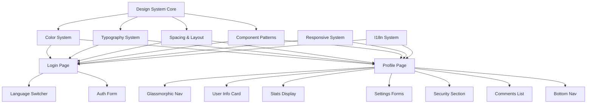
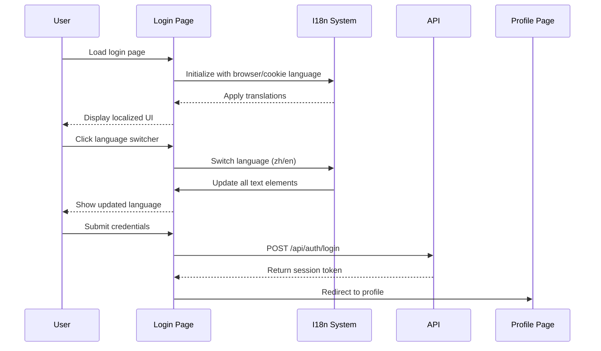

# Design Document: Editorial Profile & Login Redesign

## Overview

This design document outlines the comprehensive redesign of the Profile and Login pages using "The Radiant Minimalist" design system. The redesign focuses on creating a high-end editorial aesthetic through strategic use of no-border layouts, large rounded corners, glassmorphism effects, and a warm color palette centered around energetic orange tones. The design emphasizes visual hierarchy through background color variations rather than traditional borders, creating a sophisticated and modern user experience.

The redesign transforms two critical user-facing pages: the Login page will receive refined styling with language switching capabilities and solid-color buttons, while the Profile page undergoes a complete reconstruction featuring a card-based layout, user statistics, enhanced form designs, security settings, and full responsive support across mobile, tablet, and desktop viewports.

## Architecture

The redesign follows a component-based architecture with three primary layers: presentation (HTML templates), styling (CSS design system), and interaction (JavaScript behaviors). The design system enforces strict visual rules through CSS custom properties and utility patterns.



## Sequence Diagrams

### Login Flow with Language Switching



### Profile Page Interaction Flow

```mermaid
sequenceDiagram
    participant U as User
    participant P as Profile Page
    participant I as I18n System
    participant A as API
    
    U->>P: Load profile page
    P->>A: GET /api/me/profile
    A-->>P: Return user data
    P->>A: GET /api/me/comments
    A-->>P: Return comments list
    P->>I: Initialize with user.language
    I-->>P: Apply translations
    P-->>U: Display complete profile
    
    U->>P: Update profile form
    P->>A: PATCH /api/me/profile
    A-->>P: Success response
    P-->>U: Show success alert
    
    U->>P: Click language switcher
    P->>I: Switch language
    I->>P: Update all text
    P->>A: PATCH /api/me/profile {language}
    A-->>P: Success
    P->>P: Reload page


## Correctness Properties

*A property is a characteristic or behavior that should hold true across all valid executions of a system—essentially, a formal statement about what the system should do. Properties serve as the bridge between human-readable specifications and machine-verifiable correctness guarantees.*

### Property 1: Language Change Updates All Translatable Elements

*For any* page (Login or Profile) with a set of translatable elements, when the language is changed from one language to another, all elements marked with translation keys SHALL be updated to display text in the new language.

**Validates: Requirements 2.3, 7.3**

### Property 2: User Hero Section Renders Complete User Data

*For any* valid user object containing display_name, username, role, and created_at fields, the Profile page hero section SHALL render an avatar with the first character of display_name, and SHALL display all user metadata fields.

**Validates: Requirement 4.2**

### Property 3: Statistics Display Renders All User Metrics

*For any* user object containing statistics (posts_count, comments_count, likes_count), the Stats_Display component SHALL render all three metrics with their corresponding values and labels.

**Validates: Requirements 5.1, 5.2, 5.3**

### Property 4: Password Validation Correctly Matches Inputs

*For any* pair of password strings (new_password, confirm_password), the password validation function SHALL return true if and only if the strings are identical, and SHALL return false for any non-identical pairs.

**Validates: Requirement 6.2**

### Property 5: Error Alerts Display Error Messages

*For any* error response containing a message field, when a form submission fails, the error alert component SHALL display the error message text to the user.

**Validates: Requirement 9.4**

### Property 6: Display Name Validation Rejects Empty Input

*For any* string input, the display name validation SHALL return false for empty strings and strings containing only whitespace characters, and SHALL return true for strings containing at least one non-whitespace character.

**Validates: Requirement 9.5**

### Property 7: Comments List Renders All Required Fields

*For any* array of comment objects, where each comment contains post_title, status, created_at, and content fields, the comments list SHALL render each comment with all four fields visible in the UI.

**Validates: Requirement 10.2**
