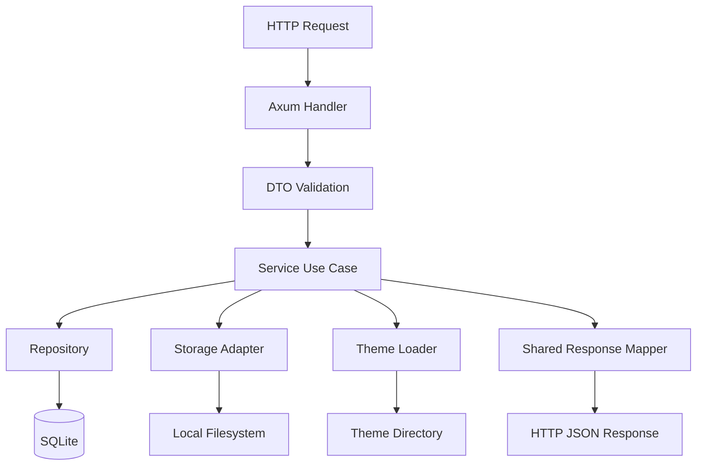
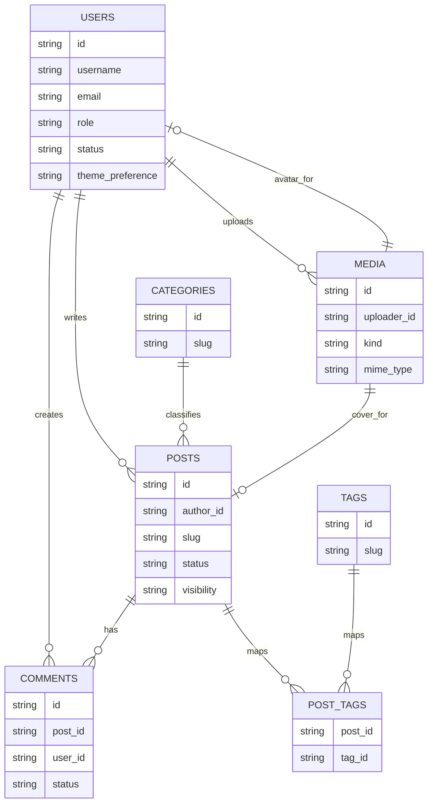
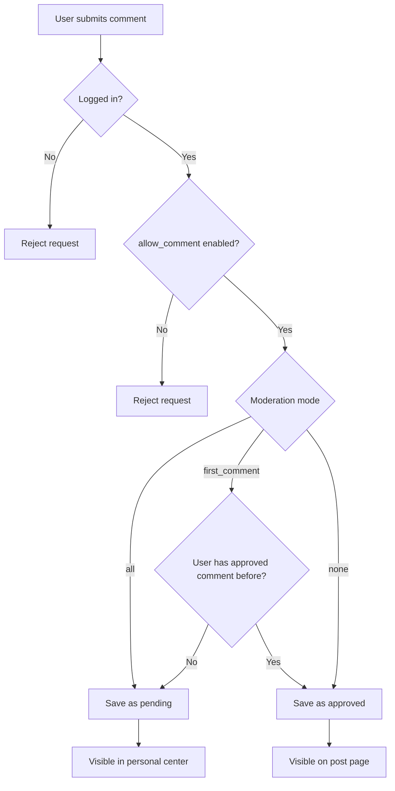
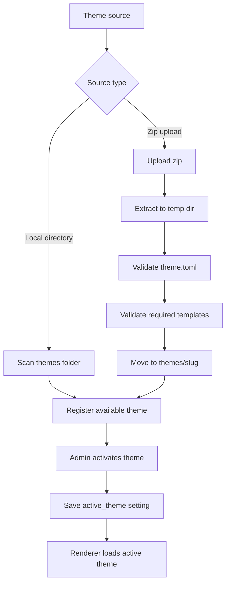
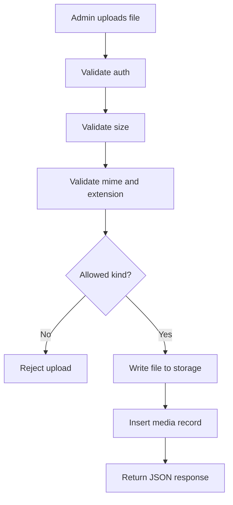
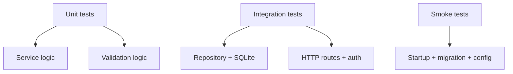
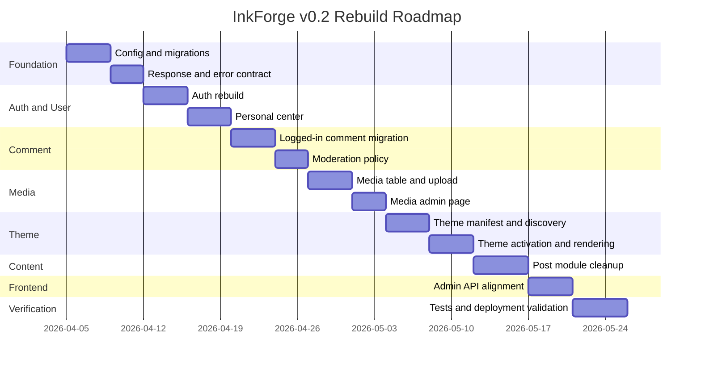

# InkForge v0.2 CMS Rebuild Plan

## 1. Goal

InkForge will be rebuilt as a single-site blog engine with the following priorities:

1. Stability and deployability first
2. Windows and Linux deployment support
3. Public registration
4. Logged-in comments only
5. Personal center for members
6. Theme system that supports local themes and uploaded third-party themes
7. Media library focused on images and audio
8. Future extensibility without over-designing now

## 2. Product Scope

### 2.1 In Scope for v0.2

1. Single-site blog
2. Public registration and login
3. Personal center
4. Posts, categories, tags
5. Logged-in comments with moderation policy
6. Media library for image/audio upload and management
7. Theme activation and theme package loading
8. Unified JSON API contract
9. Production-oriented configuration, migration, and error handling

### 2.2 Out of Scope for v0.2

1. Multi-site
2. Full plugin ecosystem
3. Complex RBAC
4. Generic page builder
5. Arbitrary file type storage
6. Overly complex protocol stack for browser clients

## 3. Product Rules

### 3.1 Site Rules

1. Single-site only
2. Anyone can register
3. Site comments require login
4. Anonymous comments are removed from the model
5. Personal center allows profile edit, password change, comment management
6. Users can delete their own comments
7. Admin config controls comment moderation strategy
8. Theme upload supports both zip upload and manual filesystem install
9. Theme mode defaults to `system`

### 3.2 Comment Rules

1. Comment author must be a registered local user
2. Comment status uses `pending`, `approved`, `rejected`, `deleted`
3. User deletion should be soft delete first
4. Admin can approve, reject, delete any comment
5. User can delete only their own comment
6. Moderation strategy must be configurable

### 3.3 Media Rules

1. Supported media kinds in v0.2: `image`, `audio`
2. Supported image types: `jpg`, `jpeg`, `png`, `webp`, `gif`
3. Supported audio types: `mp3`, `ogg`, `wav`, `m4a`
4. `svg`, archives, documents, and generic binary uploads are excluded in v0.2

## 4. Architecture Direction

### 4.1 Target Module Layout

```text
src/
  main.rs
  bootstrap/
    config.rs
    router.rs
    app_state.rs
    tracing.rs
  shared/
    error.rs
    response.rs
    pagination.rs
    auth.rs
    ids.rs
    time.rs
  modules/
    auth/
      domain.rs
      dto.rs
      repository.rs
      service.rs
      handler.rs
    user/
      domain.rs
      dto.rs
      repository.rs
      service.rs
      handler.rs
    post/
      domain.rs
      dto.rs
      repository.rs
      service.rs
      handler.rs
    comment/
      domain.rs
      dto.rs
      repository.rs
      service.rs
      handler.rs
    media/
      domain.rs
      dto.rs
      repository.rs
      service.rs
      storage.rs
      handler.rs
    theme/
      manifest.rs
      loader.rs
      renderer.rs
      service.rs
      handler.rs
    setting/
      domain.rs
      dto.rs
      repository.rs
      service.rs
      handler.rs
  infra/
    db/
      mod.rs
      migrations.rs
    jwt/
      mod.rs
    storage/
      local.rs
    theme/
      filesystem.rs
```

### 4.2 Layer Responsibilities

1. `handler`: parse request, call service, return DTO
2. `service`: business rules and use cases
3. `repository`: persistence only
4. `shared`: cross-module infrastructure helpers
5. `bootstrap`: startup wiring
6. `infra`: implementation details for storage, db, jwt, filesystem

### 4.3 Architecture Flow



## 5. Target Data Model

### 5.1 Core Entities

1. User
2. Post
3. Category
4. Tag
5. Comment
6. Media
7. Setting

### 5.2 Proposed Tables

#### users

1. `id`
2. `username`
3. `email`
4. `password_hash`
5. `display_name`
6. `avatar_media_id`
7. `bio`
8. `role` (`admin` / `member`)
9. `status` (`active` / `banned`)
10. `theme_preference` (`system` / `light` / `dark`)
11. `created_at`
12. `updated_at`
13. `last_login_at`

#### posts

1. `id`
2. `author_id`
3. `title`
4. `slug`
5. `excerpt`
6. `content_md`
7. `content_html`
8. `cover_media_id`
9. `status` (`draft` / `published` / `trashed`)
10. `visibility` (`public` / `private`)
11. `allow_comment`
12. `pinned`
13. `published_at`
14. `created_at`
15. `updated_at`

#### comments

1. `id`
2. `post_id`
3. `user_id`
4. `content`
5. `status` (`pending` / `approved` / `rejected` / `deleted`)
6. `parent_id`
7. `deleted_at`
8. `created_at`
9. `updated_at`

#### media

1. `id`
2. `uploader_id`
3. `kind` (`image` / `audio`)
4. `mime_type`
5. `original_name`
6. `stored_name`
7. `storage_path`
8. `public_url`
9. `size_bytes`
10. `width`
11. `height`
12. `duration_seconds`
13. `alt_text`
14. `created_at`

### 5.3 Data Model Diagram



## 6. Settings Strategy

### 6.1 Settings for v0.2

1. `site_title`
2. `site_description`
3. `site_url`
4. `allow_register`
5. `allow_comment`
6. `comment_require_login`
7. `comment_moderation_mode`
8. `comment_trusted_after_approved`
9. `comment_max_length`
10. `active_theme`
11. `theme_default_mode`

### 6.2 Comment Moderation Modes

1. `all`: every comment requires moderation
2. `first_comment`: first comment requires moderation, later comments may auto-approve
3. `none`: no moderation

### 6.3 Moderation Decision Flow



## 7. Theme System Plan

### 7.1 Theme Package Structure

```text
themes/
  default/
    theme.toml
    templates/
      index.html
      post.html
      profile.html
    static/
    preview.png
```

### 7.2 theme.toml Fields

1. `name`
2. `slug`
3. `version`
4. `author`
5. `description`
6. `min_inkforge_version`
7. feature flags such as `dark_mode`, `profile`, `comments`

### 7.3 Theme Sources

1. Local filesystem scan on startup
2. Zip upload from admin panel

### 7.4 Theme Activation Flow



### 7.5 Theme Rendering Requirements

1. Active theme lookup must not hardcode `themes/default`
2. Template resolution must use active theme first
3. Static assets must be served from active theme
4. Missing templates should fallback cleanly or fail with explicit error

## 8. Media Library Plan

### 8.1 Media Scope

1. Images
2. Audio

### 8.2 Media Capabilities in v0.2

1. Upload
2. List
3. Delete
4. Filter by kind
5. Copy public URL

### 8.3 Media Upload Flow



## 9. API Contract Plan

### 9.1 Unified Response

```json
{
  "code": 0,
  "message": "ok",
  "data": {},
  "request_id": "uuid-or-trace-id"
}
```

### 9.2 Unified Pagination

```json
{
  "items": [],
  "pagination": {
    "page": 1,
    "page_size": 20,
    "total": 100
  }
}
```

### 9.3 API Groups

#### auth

1. `POST /api/auth/register`
2. `POST /api/auth/login`
3. `POST /api/auth/logout`

#### me

1. `GET /api/me`
2. `PATCH /api/me/profile`
3. `PATCH /api/me/password`
4. `GET /api/me/comments`
5. `DELETE /api/me/comments/{id}`

#### public content

1. `GET /api/posts`
2. `GET /api/posts/{slug}`
3. `GET /api/posts/{slug}/comments`
4. `POST /api/posts/{slug}/comments`
5. `GET /api/categories`
6. `GET /api/tags`
7. `GET /api/themes/active`

#### admin

1. `GET /api/admin/posts`
2. `POST /api/admin/posts`
3. `GET /api/admin/posts/{id}`
4. `PATCH /api/admin/posts/{id}`
5. `DELETE /api/admin/posts/{id}`
6. `GET /api/admin/comments`
7. `POST /api/admin/comments/{id}/approve`
8. `POST /api/admin/comments/{id}/reject`
9. `DELETE /api/admin/comments/{id}`
10. `GET /api/admin/media`
11. `POST /api/admin/media`
12. `DELETE /api/admin/media/{id}`
13. `GET /api/admin/themes`
14. `POST /api/admin/themes/upload`
15. `POST /api/admin/themes/{slug}/activate`
16. `DELETE /api/admin/themes/{slug}`
17. `GET /api/admin/settings`
18. `PATCH /api/admin/settings`

### 9.4 API Evolution Rule

1. Stop mixing collection endpoints and action-style endpoints
2. Use path params for resource identity
3. Use `PATCH` for partial update
4. Keep response shapes consistent across modules

## 10. Frontend Plan

### 10.1 Admin UI

Admin UI should be updated to consume only the unified JSON contract.

Required admin pages for v0.2:

1. Dashboard
2. Posts
3. Categories
4. Tags
5. Comments
6. Media
7. Themes
8. Settings

### 10.2 Personal Center

Required member pages for v0.2:

1. Profile
2. Change password
3. My comments

### 10.3 Frontend State Direction

1. Generate or centralize TS API types
2. Remove contract drift between backend DTO and frontend types
3. Keep auth, toast, and API client separated

## 11. Infrastructure and Operations Plan

### 11.1 Must Fix Before Public Deployment

1. Environment variable prefix and config consistency
2. Formal migration mechanism
3. Internal error masking
4. Upload security baseline
5. Better auth secret handling
6. Health checks and startup validation
7. Data directories separated from code where possible

### 11.2 Deployment Targets

1. Windows
2. Linux
3. Docker

### 11.3 Runtime Concerns

1. SQLite is acceptable for v0.2
2. Do not over-couple service code to SQLite quirks
3. Keep storage adapter replaceable for future object storage

## 12. Testing Plan

### 12.1 Minimum Test Coverage

1. Register and login
2. Get current user
3. Logged-out comment rejection
4. Logged-in comment creation
5. Comment moderation modes
6. User can delete own comment only
7. Admin comment approval/rejection
8. Media upload type restrictions
9. Theme discovery and activation
10. Post publish and public list behavior

### 12.2 Testing Pyramid



## 13. Delivery Roadmap

### 13.1 v0.2 Phase Breakdown

#### Phase 1: Foundation

1. Rebuild config loading
2. Introduce formal migrations
3. Standardize response and error handling
4. Introduce shared pagination and request IDs

#### Phase 2: Auth and User

1. Rebuild register/login/me
2. Add personal center APIs
3. Add user theme preference
4. Add role and status handling

#### Phase 3: Comment Model Migration

1. Remove anonymous comment model
2. Switch comments to `user_id`
3. Add moderation policy logic
4. Add my-comments APIs

#### Phase 4: Media Library

1. Add `media` table
2. Rebuild upload handler
3. Add media listing and deletion
4. Restrict uploads to image/audio

#### Phase 5: Theme System

1. Add theme manifest
2. Add theme discovery
3. Add theme activation
4. Update renderer to active theme lookup

#### Phase 6: Post Module Cleanup

1. Move post SQL to repository
2. Move business logic to service
3. Normalize admin and public post APIs
4. Keep later extension path open for page-like content

#### Phase 7: Admin UI Adaptation

1. Update API client
2. Align frontend types with backend DTOs
3. Add media and theme pages
4. Add moderation config UI

#### Phase 8: Verification and Deployment

1. Add tests
2. Validate Windows and Linux startup
3. Update README and deployment docs
4. Prepare release checklist

### 13.2 Roadmap Diagram



## 14. Migration Strategy

### 14.1 Practical Migration Order

1. Add new tables and columns first
2. Backfill data from current schema
3. Switch handlers to new modules and DTOs
4. Remove old anonymous-comment paths
5. Remove obsolete endpoints

### 14.2 Risk Notes

1. Comment model migration is the biggest behavior change
2. Theme system refactor affects frontend rendering paths
3. API normalization will break current admin UI until adapted
4. Media library adds both db and filesystem consistency concerns

## 15. Definition of Done for v0.2

InkForge v0.2 is considered done when:

1. The site can boot with formal migrations
2. Config works consistently across Windows and Linux
3. Registration, login, and personal center work
4. Only logged-in users can comment
5. Comment moderation is configurable
6. Users can manage their own comments
7. Admin can manage posts, comments, media, themes, settings
8. Active theme is no longer hardcoded
9. Media library supports images and audio only
10. API contract is unified and frontend-aligned
11. Core tests exist and pass
12. Deployment documentation is usable
